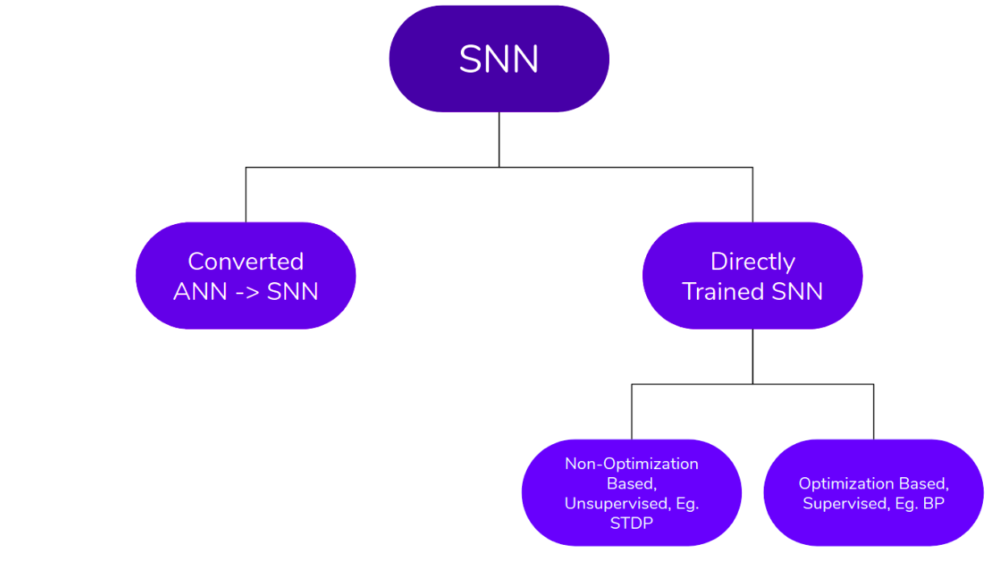

# SNN Model

## i) Framing a Question

As time progresses our Neural Networks are becoming deeper and there is tons of data to process. Conventionally, computing this via ANNs consumes a lot of energy, which is often not possible on edge//IOT devices. Hence, we seek to find a way of creating an energy-efficient and accurate model to classify images. The ideal starting point to base our model off of is the human brain which consumes only 12 watts - minuscule compared to the GPUs we use to train ANNs. So, two questions arise,(1) Can we mimic the brain's efficiency in our model whilst maintaining the accuracy of conventional models? And (2) How can we implement the best ideas from previously published work on SNN to optimize our model and reduce the existing gap between ANNs and SNNs? To answer both the questions, we first need to understand the current State of the art (SOTA) in the field of SNNs.

## ii) Understanding the SOTA

As shown above, the SOTA models for SNNs currently consist of (a)Converted, (b)Unsupervised, and (c)Supervised SNNs. 
(a) Converted SNNs use advanced ANN optimization techniques and boast nearly ANN level accuracies(Rueckauer et al., 2017; Sengupta et al., 2019) but the problem arises in the signal representation, wherein the frequencies need to be estimated requiring non-trivial passage on time, 
(b) Unsupervised methods such as STDP are biologically plausible and show high accuracies on datasets such as MNIST(Diehl and Cook, 2015) but the method does not scale well to deeper networks and hence has limited expressivity, 
(c) Supervised methods of training on Spike-Based Data requires non-conventional BP, but it shows promise in terms of energy efficiency and better generalization, thus achieving better accuracies. 

We also look at previously implemented models and their results, which can be found in the Images Folder. SNN_Results(Lee et al., 2020) shows the best models on popular datasets, with accuracies on CIFAR10 reaching 90% using Spike-based BP. SNN_Results_2(Diehl and Cook, 2015) depicts the results of past works on the MNIST dataset and SNN_Results_3(Sengupta et al., 2019) depicts the results of past BP-based works on the CIFAR10 dataset. These results leave us with a fair idea of how our model should perform to be competitive compared to already established results.

## iii) Basic Ingredients

We are interested in classifying Images, hence the input to the model will be images encoded as Poisson-distributed Spike trains, wherein the pixel intensity dictates the probability of spike generation. We will use the spike-based gradient descent algorithm as derived by Lee et al., 2020 for the Leaky Integrate and Fire(LIF) Neuron. We will also incorporate the ideas from successful deep ANN models such as LeNet, VGG, and EfficientNet. We plan to adapt Dropout and BatchNorm (non-conventional for spiking data) techniques to better regularize the network. We aim to benchmark the results against past work on object datasets such as MNIST and CIFAR10. 
The code for modeling the LIF Neuron has already been implemented by me, and can be found at, <https://github.com/DevChuriwala/SpikingNeuralNetwork>.  
